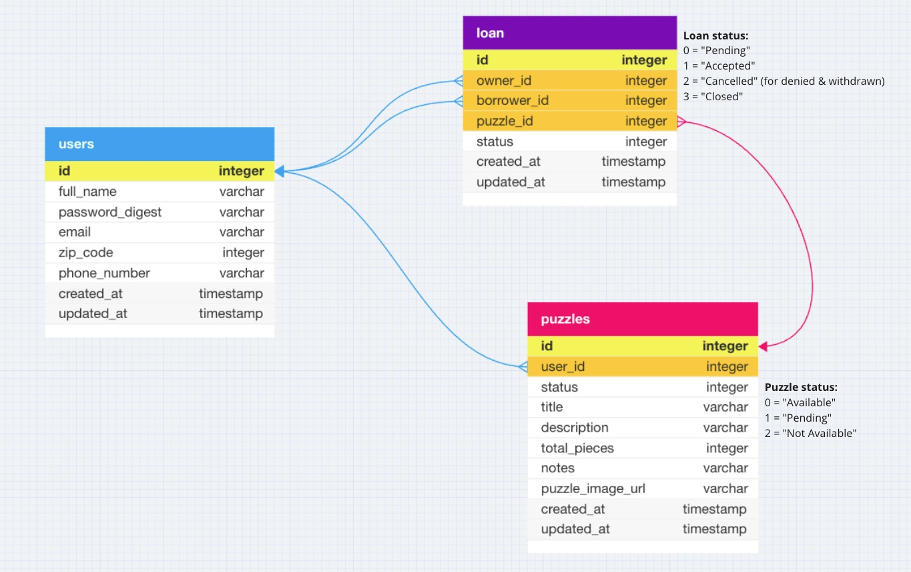

<!-- ReadMe -->

<!-- Opening -->
 

  

<h3 align="center">The Missing Piece</h3>
  

    A puzzle exchange app to get local retirees swapping puzzles to keep their minds sharp & meet others without the pressure of attending an event!
    

    If you have a collection of puzzles and are eager for new challenges, you're in the right spot. Join our community of fellow puzzle enthusiasts and dive into a world of delightful exchanges. Happy Puzzle-ing!
  

 

<!-- TABLE OF CONTENTS -->

  
Table of Contents

  <ol>
    <li>
      <a href="#about-the-project">About The Project</a>
      <ul>
        <li><a href="#hackathon">Women Who Code Hackathon for Social Good 2023</a></li>
        <li><a href="#built-with">Built With</a></li>
      </ul>
    </li>
    <li>
      <a href="#getting-started">Getting Started</a>
      <ul>
        <li><a href="#prerequisites">Prerequisites</a></li>
        <li><a href="#schema">Schema</a></li>
        <li><a href="#testing">Testing</a></li>
      </ul>
    </li>
    <li><a href="#endpoints">Endpoints</a></li>
    <!-- <li><a href="#apis">APIs Used</a></li> -->
    <li><a href="#technologies">New Technologies Used</a></li>
    <li><a href="#contact">Contributors</a></li>
    <li><a href="#refactor">Future Iterations</a></li>
  </ol>

 

<!-- ABOUT THE PROJECT -->
## About The Project

   💜  [Production Website](https://the-missing-piece.vercel.app/)
    
   💜  [Backend Service](https://intense-peak-28151.herokuapp.com/)
    
   💜  [Front End Repository](https://github.com/WWC-Hackathon-2023/the_missing_piece_fe)
    

   <!-- * If there is a [Video/Slide Presentation]() place it here-->

<!-- WWC Hackathon -->
### Women Who Code Hackathon for Social Good 2023

  **The Missing Piece** was created by an international team of both FrontEnd and BackEnd developers for the [Women Who Code (WWC) Hackathon for Social Good 2023](https://hopin.com/events/wwcode-hackathon-for-social-good/registration). 
  
  The Women Who Code Hackathon for Social Good requires that every project aims to support a target group: The Missing Piece Team chose to address is the emotional and mental wellbeing of retirees and seniors by creating an app to facilitate the sharing of items. For our MVP (minimum viable product) we chose to focus on one item type: puzzles.
  
  Why puzzles? Well, puzzles tend to accumulate over a lifetime and end up in boxes in the attic, never to be seen again. They're purchased, completed a few times, and then put away. A puzzle is a type of item that can be exchanged and returned over and over... plus it's fun to work on new ones without having to buy yet another puzzle!

  - `Challenge Statement`

    According to the National Institute of Health, prior to the COVID outbreak, investigators found out that 24% of American individuals 65 and over were socially isolated. That's approximately 7.7 million people. The U.S. Health and Retirement Study reports that 43% of Americans aged 60 or older also reported feeling lonely, which can lead to debilitating issues like depression and anxiety for our loved ones... now think about this on a global scale! [ref](https://www.ncbi.nlm.nih.gov/pmc/articles/PMC7437541/) 

    In an already isolated world, how do we use technology to connect our beloved elders through a common interest that is simple to use and can lead to actual genuine connections? By joining the Missing Piece!
  
  - `Solution Statement`
    The Missing Piece aims to connect retirees through a common interest with an easy, low-pressure opportunity to share puzzles with other locals. Not only will this app encourage them get out of the house in order to swap puzzles with others but could hopefully lead to building genuine friendships with people in their local neighborhood. Who knows, maybe they'll start puzzle-parties and work together too!

    On top of this, [studies](https://www.ncbi.nlm.nih.gov/pmc/articles/PMC5588550/) have shown that solving puzzles keep our minds sharp! It reduces the rate of cognitive decline and increases short-term memory, concentration, and visual-spatial reasoning. Plus, through the simple act of solving a little puzzle, improvements in mood and lower stress-levels have been found.

    With the Missing Piece app, users can search for puzzles in their local area. Then they can sign up or login to see their dashboard where they'll be able to upload their own collection of puzzles, see who's requested to borrow a puzzle, and track their own requests to borrow. Once an owner of a puzzle accepts the request, both user's email and phone number are provided so they can coordate when and where to exchange the puzzle. Once a puzzle has been returned, it is then ready to be borrowed again!

(<a href="#readme-top">back to top</a>)

<!-- Built With -->
### Built With

 
 

(<a href="#readme-top">back to top</a>)

<!-- GETTING STARTED -->
## Getting Started

If you'd like to demo this API on your local machine:
1. Ensure you have the prerequisites
2. Clone this repo: `git@github.com:WWC-Hackathon-2023/missing_piece_api.git`
3. Navigate to the root folder: `cd missing_piece_api`
4. Run: `bundle install`
5. Run: `rails db:{create,migrate}`
6. Inspect the `/db/schema.rb` and compare to the 'Schema' section below to ensure migration has been done successfully
7. Run: `rails s`
8. Visit http://localhost:3000/

<!-- Prerequisites -->
### Prerequisites

- Ruby Version 3.1.1
- Rails Version 7.0.8.x
- Bundler Version 2.4.13

<!-- Schema -->
### Schema

  

<!-- Testing -->
### Testing
To test the entire spec suite, run `bundle exec rspec`.
*All tests should be passing.*

Happy path and sad path testing were considered and tested. When a request cannot be completed, an error object is returned.

  
Error Objects

    <pre>
    <code>
{
  "errors": [
    {
      "status": "404"
      "title": "Invalid Request",
      "detail": [
        "Couldn't find User with 'id'=<id>"
         ]
     }
   ]
}
    </code>
  </pre>

   <pre>
    <code>
{ 
  "error": "Unable to update loan status" 
}
    </code>
  </pre>

(<a href="#readme-top">back to top</a>)

<!-- Endpoints -->
## Endpoints

  
<code>PUT "/api/v1/puzzles"</code>

  Request Body:
  <pre>
    <code>
{
  "zip_code": 12345
}
    </code>
  </pre>

  Response:
   
  Status: `200`

  <pre>
    <code>
{
    "data": [
        {
            "id": "1",
            "type": "puzzle",
            "attributes": {
                "user_id": 1,
                "status": "Available",
                "title": "Flower Cycle",
                "description": "A flower collage by Rosalind Wise",
                "total_pieces": 1000,
                "notes": "Very Difficult! Only for the brave of heart!",
                "puzzle_image_url": "https://cloudinary.com/image/Flower_Cycle.jpg"
            }
        },
        {
            "id": "2",
            "type": "puzzle",
            "attributes": {
                "user_id": 1,
                "status": "Available",
                "title": "Mountain Chalet",
                "description": "Cabin near lake and mountains",
                "total_pieces": 1000,
                "notes": "Relaxing, feels like you're in Colorado!",
                "puzzle_image_url": "https://cloudinary.com/image/Mountain_Chalet.jpg"
            }
        }, {...}
    ]
}
    </code>
  </pre>

  
<code>POST "/api/v1/users"</code>

  Request Body:
  <pre>
    <code>
{
  "full_name": "Diana Puzzler",
  "email": "d.puzzle@gmail.com",
  "password": "PuzzleQueen1",
  "password_confirmation": "PuzzleQueen1",
  "zip_code": 12345, 
  "phone_number": 5051230000
}
    </code>
  </pre>

  Response:
   
  Status: `201` 

  <pre>
    <code>
{
    "data": {
        "id": "1",
        "type": "user",
        "attributes": {
            "full_name": "Diana Puzzler",
            "email": "d.puzzle@gmail.com",
            "zip_code": 12345,
            "phone_number": "(505) 123-0000"
        }
    }
}
    </code>
  </pre>

  
<code>POST "/api/v1/login"</code>

    Request Body:
  <pre>
    <code>
{
  "email": "d.puzzle@gmail.com",
  "password": "PuzzleQueen1"
}
    </code>
  </pre>

  Response:
   
  Status: `201` 

  <pre>
    <code>
{
    "data": {
        "id": "1",
        "type": "user",
        "attributes": {
            "full_name": "Diana Puzzler",
            "email": "d.puzzle@gmail.com",
            "zip_code": 12345,
            "phone_number": "(505) 123-0000"
        }
    }
}
    </code>
  </pre>

  
<code>DELETE "/api/v1/users/:id/logout"</code>

  Response:
   
  Status: `204`

  
<code>GET "/api/v1/users/:id"</code>

  Response:
   
  Status: `200`
  <pre>
    <code>
{
    "data": {
        "id": "1",
        "type": "user",
        "attributes": {
            "full_name": "Diana Puzzler",
            "email": "d.puzzle@gmail.com",
            "zip_code": 12345,
            "phone_number": "(505) 123-0000"
        }
    }
}
    </code>
  </pre>

  
<code>GET "/api/v1/users/:id/dashboard"</code>

  Response:
   
  Status: `200`
  <pre>
    <code>
{
    "data": {
        "id": "1",
        "type": "dashboard",
        "attributes": {
            "user_info": {
                "full_name": "Diana Puzzler",
                "email": "d.puzzle@gmail.com",
                "zip_code": 12345,
                "phone_number": "(505) 123-0000"
            },
            "owner_loans": [
                {
                    "loan_id": 1,
                    "owner_id": 1,
                    "borrower_id": 2,
                    "loan_status": "Pending",
                    "loan_created_at": "2023-10-21T02:52:18.777Z",
                    "puzzle_id": 1,
                    "puzzle_image_url": "https://cloudinary.com/imageFlower_Cycle.jpg",
                    "puzzle_title": "Flower Cycle",
                    "puzzle_status": "Pending"
                }, {...}
            ],
            "borrower_loans": [
                {
                    "loan_id": 5,
                    "owner_id": 2,
                    "borrower_id": 1,
                    "loan_status": "Accepted",
                    "loan_created_at": "2023-10-21T17:01:40.848Z",
                    "puzzle_id": 55,
                    "puzzle_image_url": "https://cloudinary.com/image/Maroon_Lake.jpg",
                    "puzzle_title": "Maroon Lake",
                    "puzzle_status": "Not Available"
                }, {...}
            ]
        }
    }
}
    </code>
  </pre>

  
<code>POST "/api/v1/users/:id/puzzles"</code>

  Request Body:
  <pre>
    <code>
{
    "title": "Wild Beauty",
    "description": "Horses running in the snow by Chris Cummings.",
    "total_pieces": 1000,
    "notes": "Lots of white snow...beware!",
    "puzzle_image_url": "https://cloudinary.com/image/Wild_Beauty.jpg"
}
    </code>
  </pre>

  Response:
   
  Status: `201` 

  <pre>
    <code>
{
    "data": {
        "id": "3",
        "type": "puzzle",
        "attributes": {
            "user_id": 1,
            "status": "Available",
            "title": "Wild Beauty",
            "description": "Horses running in the snow by Chris Cummings.",
            "total_pieces": 1000,
            "notes": Lots of white snow...beware!",
            "puzzle_image_url": "https://cloudinary.com/image/Wild_Beauty.jpg"
        }
    }
}
    </code>
  </pre>

  
<code>GET "/api/v1/users/:id/puzzles"</code>

  Response: 
   
  Status: `200`
  <pre>
    <code>
{
    "data": [
        {
            "id": "4",
            "type": "puzzle",
            "attributes": {
                "user_id": 1,
                "status": "Available",
                "title": "Humming Bird & Flowers",
                "description": "Hummingbirds investigating some pretty flowers.",
                "total_pieces": 1000,
                "notes": "Not as hard as you might think!",
                "puzzle_image_url": "https://res.cloudinary.com/image/info/Hummingbirds_Flowers.jpg"
            }
        },
        {
            "id": "5",
            "type": "puzzle",
            "attributes": {
                "user_id": 1,
                "status": "Available",
                "title": "Durango Silverton",
                "description": "Train coming around the bend!",
                "total_pieces": 1000,
                "notes": "Feels like a step back in time!",
                "puzzle_image_url": "https://res.cloudinary.com/image/info/Durango_Silverton.jpg"
            }
        }, {...}
    ]
}
    </code>
  </pre>

  
<code>GET "/api/v1/users/:id/puzzles/:id" </code>

  Response: 
   
  Status: `200`
  <pre>
    <code>
{
    "data": {
        "id": "1",
        "type": "puzzle",
        "attributes": {
            "user_id": 1,
            "status": "Available",
            "title": "Flower Cycle",
            "description": "A flower collage by Rosalind Wise",
            "total_pieces": 1000,
            "notes": "Very Difficult! Only for the brave of heart!",
            "puzzle_image_url": "https://cloudinary.com/image/Flower_Cycle.jpg"
        }
    }
}
    </code>
  </pre>

  
<code>PATCH "/api/v1/users/:id/puzzles/:id"</code>

  Request Body:
  <pre>
    <code>
{
  "status": 2, 
  "title": "Rosalind Wise Flower Cycle", 
  "description": "A colorful flower collage", 
  "total_pieces": 2000,
  "notes":  "Challenging but not too much. The brave of heart can do it!"
}
    </code>
  </pre>

  Response:
   
  Status: `200` 

  <pre>
    <code>
{
    "data": {
        "id": "1",
        "type": "puzzle",
        "attributes": {
            "user_id": 1,
            "status": "Not Available",
            "title": "Rosalind Wise Flower Cycle",
            "description": "A colorful flower collage",
            "total_pieces": 2000,
            "notes": "Challenging but not too much. The brave of heart can do it!",
            "puzzle_image_url": "https://res.cloudinary.com/image/info/Flower_Cycle.jpg"
        }
    }
}
    </code>
  </pre>

  
<code>POST "/api/v1/users/:id/loans"</code>

  Request Body:
  <pre>
    <code>
{
    "borrower_id": 2, 
    "puzzle_id": 2
}
    </code>
  </pre>

  Response:
   
  Status: `201` 

  <pre>
    <code>
{
    "data": {
        "id": "7",
        "type": "loan",
        "attributes": {
            "owner_id": 1,
            "borrower_id": 2,
            "puzzle_id": 2,
            "status": "Pending"
        }
    }
}
    </code>
  </pre>

  
<code>PATCH "/api/v1/users/:id/loans/:id"</code>

  owner clicks `accept` OR borrower clicks `withdraw` OR owner clicks `deny` OR when loan is `complete` 
  Request Body:
  <pre>
    <code>
{
  "action_type": "accept"
}
    </code>
  </pre>

  Response:
   
  Status: `200` 

  <pre>
    <code>
{
    "data": {
        "id": "7",
        "type": "loan",
        "attributes": {
            "owner_id": 1,
            "borrower_id": 2,
            "puzzle_id": 2,
            "status": "Accepted"
        }
    }
}
    </code>
  </pre>

 

All endpoints can also be found in the [JSON Contract](https://gist.github.com/MelTravelz/8983a104ca5c4e822dedb8d5e1c42622) 

(<a href="#readme-top">back to top</a>)

<!-- APIs Used 
<h2 id="apis">APIs Used</h2>
[Name](link) was consumed to generate ________
[Name](link) was used to create __________

(<a href="#readme-top">back to top</a>)
 -->

<!-- Technologies Used -->
<h2 id="technologies">New Technologies Used</h2>

[Passage by 1Password](https://passage.1password.com/) was used to authenticate users and ensure login was easy, safe, and quick.
  

[Cloudinary](https://cloudinary.com/) was used to allow users to seamlessly upload images for their puzzles.

(<a href="#readme-top">back to top</a>)

<!-- Future Iterations -->

<h2 id="refactor">Future Iterations</h2>

  
Refactor/Changes

  <dl>
    <dt>Conduct a solid refactor of existing code</dt>
      <dd>- With the limited time of the Hackathon, reviewing the code slower would be first</dd>
    <dt>Allow a loan to have more than one puzzle</dt>
      <dd>- This was the original idea for the schema and would involve a join table</dd>
    <dt>Refactor our connectiong with Cloudinary for multiple image upload & profile images</dt>
      <dd>- This would possibly require an new table to store puzzle image urls</dd>
    <dt>Include other item types that could be borrowed</dt>
      <dd>- Deciding which other item types might be most suited for this app</dd>
      <dd>- And we'd create even more tables in the database</dd>
    <dt>Incorporate internal communication tools</dt>
      <dd>- Internal or external emails and/or text messages might be concidered</dd>
      <dd>- If so we'd look to Twilio/Send Grid as a start</dd>
    <dt>Allow users to create a 'Puzzle Party' and invite others</dt>
      <dd>- Additional tables in the database would be required: parties and user_parties</dd>
      <dd>- The user table might also become a self-referential table so users can store "friends"</dd>
    <dt>Add functionality so users can share images or 'Puzzle Parties' on social media</dt>
        <dd>- Examples would include Facebook and Instagram</dd>
    <dt>Scale up for international participation</dt>
      <dd>- Changes would need to be made to both FE form input and BE database validations to allow for multi-formatted and multi-length input of zip codes and phone numbers.</dd>
      <dd>- As a website scales up run times become a consideration so we would also aim to implement background workers and caching</dd>
  </dl>

(<a href="#readme-top">back to top</a>)

<h2 id="contact">Contributors</h2>

|  |  |  |  |  |  |
| ------------------ | ------------ | -------------- | ----------- | -------------- | ----------- |
| Andrea Ramirez | Carmen Luna | Natalia Torrejon | Kemi Thomas | Bisrat Melak | Melony Erin Franchini |
| FrontEnd | FrontEnd | FrontEnd | FullStack | BackEnd | BackEnd & Team Lead |
| [GitHub](https://github.com/paolandre ) | [GitHub](https://github.com/CarmenLunaP) | [GitHub](https://github.com/Natalia392) | [GitHub](https://github.com/kem247) | [GitHub](https://github.com/bisratlike) | [GitHub](https://github.com/MelTravelz) |
| [LinkedIn](https://www.linkedin.com/in/paola-andrea-ramirez-quintero/) |  [LinkedIn](https://www.linkedin.com/in/carmen-luna-cllp/) | [LinkedIn](https://www.linkedin.com/in/natalia-torrejon-developer/) | [LinkedIn](https://www.linkedin.com/in/kemi-thomas/) | [LinkedIn](https://www.linkedin.com/in/bisrat-melak/) | [LinkedIn](https://www.linkedin.com/in/melony-erin-franchini/) |

(<a href="#readme-top">back to top</a>)

