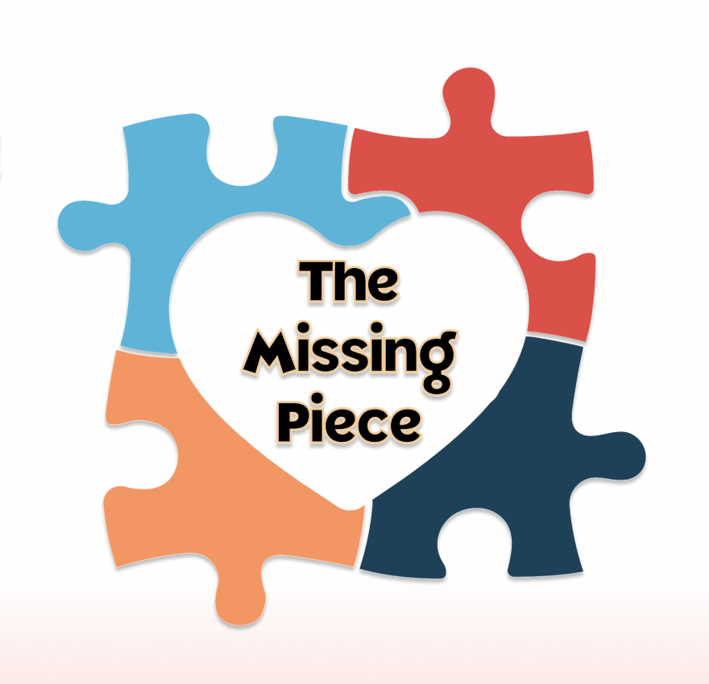

<!-- ReadMe -->

<!-- Opening -->
 

  

<h3 align="center">The Missing Piece</h3>
  

    A puzzle exhange app to get local retirees swapping puzzles to keep their minds sharp & meet others without the pressure of attending an event!
    

    If you have a collection of puzzles and you're eager to swap them for new challenges, you're in the right spot. Join our community of fellow puzzle enthusiasts and dive into a world of delightful exchanges. Happy Puzzle-ing!
  

 

<!-- TABLE OF CONTENTS -->

  
Table of Contents

  <ol>
    <li>
      <a href="#about-the-project">About The Project</a>
      <ul>
        <li><a href="#hackathon">Women Who Code Hackathon for Social Good</a></li>
        <li><a href="#built-with">Built With</a></li>
      </ul>
    </li>
    <li>
      <a href="#getting-started">Getting Started</a>
      <ul>
        <li><a href="#prerequisites">Prerequisites</a></li>
        <li><a href="#schema">Schema</a></li>
        <li><a href="#testing">Testing</a></li>
      </ul>
    </li>
    <li><a href="#endpoints">Endpoints</a></li>
    <!-- <li><a href="#apis">APIs Used</a></li> -->
    <li><a href="#technologies">Other Technologies Used</a></li>
    <li><a href="#contact">Contributors</a></li>
    <li><a href="#refactor">Future Iterations</a></li>
  </ol>

 

<!-- ABOUT THE PROJECT -->
## About The Project

   💜  [Production Website](add link)
    
   💜  [Backend Service](https://intense-peak-28151.herokuapp.com/)
    
   💜  [Front End Repository](https://github.com/WWC-Hackathon-2023/the_missing_piece_fe)
    
   <!-- * [Video/Slide Presentation]() -->

<!-- WWC Hackathon -->
### Women Who Code Hackathon for Social Good

  **The Missing Piece** was created by an international team of both FrontEnd and BackEnd developers for the [Women Who Code (WWC) Hackathon for Social Good 2023](https://hopin.com/events/wwcode-hackathon-for-social-good/registration). The Social Good that the Missing Piece Team chose to address is the emotional and mental wellbeing of retirees and seniors. 

  - `Challenge Statement`

    According to the National Institute of Health, prior to the COVID outbreak, investigators found out that 24% of American individuals 65 and over were socially isolated. That's approximately 7.7 million people. The U.S. Health and Retirement Study reports that 43% of Americans aged 60 or older also reported feeling lonely, which can lead to debilitating issues like depression and anxiety for our loved ones... now think about this on a global scale! [ref](https://www.ncbi.nlm.nih.gov/pmc/articles/PMC7437541/) 

    In an already isolated world, how do we use technology to connect our beloved elders through a common interest that is simple to use and can lead to actual genuine connections? By joining the Missing Piece!
  
  - `Solution Statement`
    The Missing Piece aims to connect retirees through a common interest with an easy, low-pressure opportunity to share puzzles with other locals. Not only will this app encourage them get out of the house in order to swap puzzles with others but could hopefully lead to building genuine friendships with people in their local neighborhood. Who knows, maybe they'll start puzzle-parties and work together too!

    On top of this, [studies](https://www.ncbi.nlm.nih.gov/pmc/articles/PMC5588550/) have shown that solving puzzles keep our minds sharp! It reduces the rate of cognitive decline and increases short-term memory, concentration, and visual-spatial reasoning. Plus, through the simple act of solving a little puzzle, improvements in mood and lower stress levels have been seen.

    With the Missing Piece app, users can search for puzzles in their local area. Then they can sign up or login to see their dashboard where they'll be able to upload their own collection of puzzles, see who's requested to borrow a puzzle, and track their own requests to borrow. Once an owner of a puzzle accepts the request, both user's email and phone number are provided so they can coordate when and where to exchange the puzzle. Once a puzzle has been returned, it is then ready to be borrowed again!

(<a href="#readme-top">back to top</a>)

<!-- Built With -->
### Built With

 
 

<!-- 

 -->

(<a href="#readme-top">back to top</a>)

<!-- GETTING STARTED -->
## Getting Started

If you'd like to demo this API on your local machine:
1. Ensure you have the prerequisites
2. Clone this repo: `git@github.com:WWC-Hackathon-2023/missing_piece_api.git`
3. Navigate to the root folder: `cd missing_piece_api`
4. Run: `bundle install`
5. Run: `rails db:{create,migrate}`
6. Inspect the `/db/schema.rb` and compare to the 'Schema' section below to ensure migration has been done successfully
7. Run: `rails s`
8. Visit http://localhost:3000/

<!-- Prerequisites -->
### Prerequisites

- Ruby Version 3.1.1
- Rails Version 7.0.4.x
- Bundler Version 2.4.9

<!-- Schema -->
### Schema

<!--  -->

<!-- Testing -->
### Testing
To test the entire spec suite, run `bundle exec rspec`.
*All tests should be passing.*

Happy path, sad path, and edge testing were considered and tested. When a request cannot be completed, an error object is returned.

  
Error Object

    <pre>
    <code>
{
  "errors": [
    {
      "status": "404"
      "title": "Invalid Request",
      "detail": [
        "Couldn't find User with 'id'=<id>"
         ]
     }
   ]
}
    </code>
  </pre>

(<a href="#readme-top">back to top</a>)

<!-- Endpoints -->
## Endpoints

  
<code>GET "/api/v1/root"</code>

  Response:
  <pre>
    <code>
      { data }
    </code>
  </pre>

  
<code>GET "/api/v1/puzzles"</code>

  Request Body:
  <pre>
    <code>
{
  "zip_code": 12345
}
    </code>
  </pre>

  Response:
  <pre>
    <code>
{ data }
    </code>
  </pre>

  
<code>GET "/api/v1/users/:id/puzzles/:id"</code>

  Response:
  <pre>
    <code>
{ data }
    </code>
  </pre>

  
<code>Authorization Page</code>

  Response:
  <pre>
    <code>
{ data }
    </code>
  </pre>

  
<code>GET "/api/v1/users/:id"</code>

  Response:
  <pre>
    <code>
{ data }
    </code>
  </pre>

  
<code>POST "/api/v1/users"</code>

  Request Body:
  <pre>
    <code>
{ data }
    </code>
  </pre>

  Response: 
  <pre>
    <code>
{ data }
    </code>
  </pre>

  
<code>GET "/api/v1/users/:id/loans"</code>

  Response
  <pre>
    <code>
{ data }
    </code>
  </pre>

  
<code>GET "/api/v1/users/:id/puzzles"</code>

  Response:
  <pre>
    <code>
{ data }
    </code>
  </pre>

  
<code>POST "/api/v1/users/:id/puzzles"</code>

  Request Body:
  <pre>
    <code>
{ data }
    </code>
  </pre>

  Response: 
  <pre>
    <code>
{ data }
    </code>
  </pre>

  
<code>PATCH "/api/v1/users/:id/puzzles/:id"</code>

  Request Body:
  <pre>
    <code>
{ data }
    </code>
  </pre>

  Response: 
  <pre>
    <code>
{ data }
    </code>
  </pre>

  
<code>DELETE "/api/v1/users/:id/puzzles/:id"</code>

  Response:
  <pre>
    <code>
{ data }
    </code>
  </pre>

 

View these endpoints in 

(<a href="#readme-top">back to top</a>)

<!-- APIs Used 
<h2 id="apis">APIs Used</h2>

[Name](link) was consumed to generate ________

[Name](link) was used to create __________

(<a href="#readme-top">back to top</a>)
 -->

<!-- Technologies Used -->
<h2 id="technologies">Technologies Used</h2>

[Passage by 1Password](https://passage.1password.com/) was used to authenticate users and ensure login was easy, safe, and quick.

<!-- NOTE: need to add image and more details -->

[Amazon Web Services](https://aws.amazon.com/) was used to allow users to upload photos for their puzzles.

  
<strong>Amazon S3 Cloud Object Storage</strong>
 
  
By including amazon's web service for storage, we can allow users to upload their pictures which are then saved as objects in a "bucket".  

  More information on the gem used for this(`aws-sdk-s3`) can be found [here](https://github.com/aws/aws-sdk-ruby)

 

(<a href="#readme-top">back to top</a>)

<!-- Future Iterations -->

<h2 id="refactor">Future Iterations</h2>

  
Refactor/Changes

  <dl>
    <dt>Idea1</dt>
      <dd>- notes</dd>
    <dt>Idea2</dt>
      <dd>- notes</dd>
  </dl>

(<a href="#readme-top">back to top</a>)

<h2 id="contact">Contributors</h2>

|  |  |  |  |  |  |
| ------------------ | ------------ | -------------- | ----------- | -------------- | ----------- |
| Andrea Ramirez | Carmen Luna | Natalia Torrejon | Kemi Thomas | Bisrat Melak | Melony Erin Franchini |
| FrontEnd | FrontEnd | FrontEnd | FullStack | BackEnd | BackEnd & Team Lead |
| [GitHub](https://github.com/paolandre ) | [GitHub](https://github.com/CarmenLunaP) | [GitHub](https://github.com/Natalia392) | [GitHub](https://github.com/kem247) | [GitHub](https://github.com/bisratlike) | [GitHub](https://github.com/MelTravelz) |
| [LinkedIn](https://www.linkedin.com/in/paola-andrea-ramirez-quintero/) |  [LinkedIn](https://www.linkedin.com/in/carmen-luna-cllp/) | [LinkedIn](https://www.linkedin.com/in/natalia-torrejon-developer/) | [LinkedIn](https://www.linkedin.com/in/kemi-thomas/) | [LinkedIn](https://www.linkedin.com/in/bisrat-melak/) | [LinkedIn](https://www.linkedin.com/in/melony-erin-franchini/) |

(<a href="#readme-top">back to top</a>)

